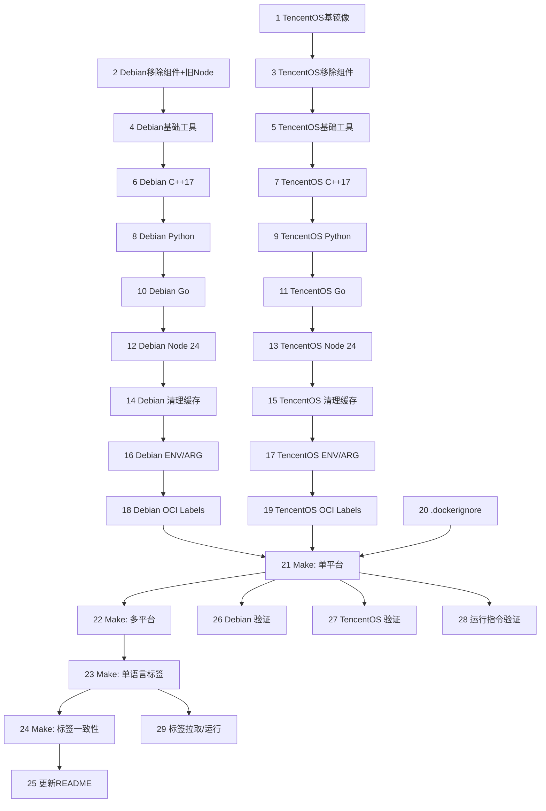

# devcontainer - 任务规划（feat-env-upgrade-make-build-tags）

本任务规划依据以下文档：`/specsai/init.md`、`/specsai/constitution.md`、`/specsai/feat-env-upgrade-make-build-tags/prd.md`、`/specsai/feat-env-upgrade-make-build-tags/plan.md`。所有任务严格遵循规约中的日志与错误处理要求，不引入与需求无关的组件。

## 原子任务列表（按依赖顺序）

1. 更新 TencentOS 基础镜像（tencentos4-minimal）
- 描述：将 `Dockerfile-tencentos` 基础镜像替换为 `tencentos/tencentos4-minimal`。
- 验收：基础镜像变更生效，构建初始阶段通过。

2. Debian：移除不需要组件与旧 Node.js
- 描述：从 `Dockerfile-debian` 中移除 kubectl、hexctl、Neovim 及其配置，并移除旧版 Node.js 安装。
- 验收：构建日志中不再出现上述组件与旧 Node.js 安装步骤。

3. TencentOS：移除不需要组件
- 描述：从 `Dockerfile-tencentos` 中移除 kubectl、hexctl、Neovim 及其配置。
- 验收：构建日志中不再出现上述组件安装与配置步骤。

4. Debian：安装 make 与基础工具
- 描述：确保 `make`、`git`、`cmake`、`zsh`、`tmux` 等基础工具可用。
- 验收：容器内 `make --version` 可用，其他工具正常执行。

5. TencentOS：安装 make 与基础工具
- 描述：同上，适配 `yum/dnf`。
- 验收：容器内 `make --version` 可用，其他工具正常执行。

6. Debian：提供 C++17 编译环境
- 描述：安装 `gcc/g++` 并验证支持 `-std=c++17`。
- 验收：容器内可编译最小 C++17 程序通过。

7. TencentOS：提供 C++17 编译环境
- 描述：同上，适配 TencentOS。
- 验收：容器内可编译最小 C++17 程序通过。

8. Debian：提供 Python 3.11+（最新小版本）
- 描述：优先系统包；若不足则多阶段源码构建并拷贝产物。
- 验收：`python3 --version` >= 3.11.x，版本与标签一致。

9. TencentOS：提供 Python 3.11+（最新小版本）
- 描述：同上，适配 TencentOS。
- 验收：`python3 --version` >= 3.11.x，版本与标签一致。

10. Debian：提供 Go 1.25+（最新小版本）
- 描述：使用官方 tarball 安装到 `/usr/local/go`，设置 PATH。
- 验收：`go version` >= 1.25.x，版本与标签一致。

11. TencentOS：提供 Go 1.25+（最新小版本）
- 描述：同上，适配 TencentOS。
- 验收：`go version` >= 1.25.x，版本与标签一致。

12. Debian：提供 Node.js 24 LTS（最新小版本）
- 描述：优先官方二进制；可选官方 LTS 源。
- 验收：`node --version` 主版本 24，补丁为最新，版本与标签一致。

13. TencentOS：提供 Node.js 24 LTS（最新小版本）
- 描述：使用官方二进制方式确保版本一致。
- 验收：`node --version` 主版本 24，补丁为最新，版本与标签一致。

14. Debian：清理包管理缓存与临时文件
- 描述：在层末清理 apt 缓存与临时文件。
- 验收：无残留缓存路径；镜像体积降低。

15. TencentOS：清理包管理缓存与临时文件
- 描述：在层末清理 yum/dnf 缓存与临时文件。
- 验收：无残留缓存路径；镜像体积降低。

16. Debian：设置 ENV 与 ARG
- 描述：设置 `PATH`（含 `/usr/local/go/bin`），添加 `ARG`（GO_VERSION、PY_VERSION、NODE_VERSION）。
- 验收：容器内 PATH 生效；`env` 可见相关变量；构建通过。

17. TencentOS：设置 ENV 与 ARG
- 描述：同上，适配 TencentOS。
- 验收：容器内 PATH 生效；`env` 可见相关变量；构建通过。

18. Debian：增加 OCI Labels
- 描述：添加标准 OCI 标签与语言版本标签。
- 验收：`docker inspect` 可见 labels 且值正确。

19. TencentOS：增加 OCI Labels
- 描述：同上，适配 TencentOS。
- 验收：`docker inspect` 可见 labels 且值正确。

20. 新增 .dockerignore
- 描述：添加 `.git/`、`specsai/`、临时文件等忽略项。
- 验收：构建上下文大小减小；不影响构建结果。

21. 新增 Makefile：单平台构建
- 描述：提供 `make build`、`make run`、`make push` 基本目标；支持 `OS`、`PLATFORM`、`REPO`、`GO_VER`、`PY_VER`、`NODE_VER`、`TAG_EXTRA`。
- 验收：`make build OS=debian|tencentos4` 构建成功。

22. 新增 Makefile：多平台构建（buildx）
- 描述：`make build-multi PLATFORMS=linux/amd64,linux/arm64` 一次性构建并 `--push`。
- 验收：在配置了 buildx 的环境中成功产出多平台镜像。

23. 新增 Makefile：镜像打标签（系统+单语言）
- 描述：生成 `<repo>:<os>-go<ver>`、`<repo>:<os>-py<ver>`、`<repo>:<os>-node<ver>`、`<repo>:<os>-cpp17`。
- 验收：`docker images` 可见标签；拉取/运行正常。

24. 新增 Makefile：标签一致性校验
- 描述：`make inspect-labels` 对比 `org.opencontainers.image.version.*` 与 Make 变量，不一致则失败。
- 验收：一致性校验通过；故意改错能触发失败。

25. 更新 README 使用指南
- 描述：补充 Make 构建、平台选择、多平台构建、标签规范、macOS Apple Silicon 注意事项。
- 验收：内容清晰，命令可复制执行。

26. Debian：版本与能力测试
- 描述：验证 `python3/go/node` 版本与 C++17 编译。
- 验收：版本满足要求；C++17 程序编译运行通过。

27. TencentOS：版本与能力测试
- 描述：同上验证 TencentOS。
- 验收：版本满足要求；C++17 程序编译运行通过。

28. 运行指令验证（两变体）
- 描述：`make run OS=<...>` 交互进入容器，验证默认 shell 与基础工具。
- 验收：启动正常，`zsh`/`tmux` 可用。

29. 标签拉取与运行验证（两变体）
- 描述：对 `go/py/node/cpp17` 标签执行 `docker pull` 与 `docker run --rm`，确认可用。
- 验收：拉取成功且命令执行正常。

## 任务依赖图（Mermaid）

## 说明
- 所有 Dockerfile 修改需使用 `&&` 串联命令并在层末清理缓存；遵守 `/specsai/constitution.md` 的日志与错误处理约定。
- 标签使用“系统+单语言+精确小版本”策略（含 node24.x.y），C++ 使用 `cpp17` 能力标签。
- macOS Apple Silicon 通过 Docker Desktop 运行 `linux/arm64` 镜像；`build-multi` 默认 `linux/amd64,linux/arm64`。
